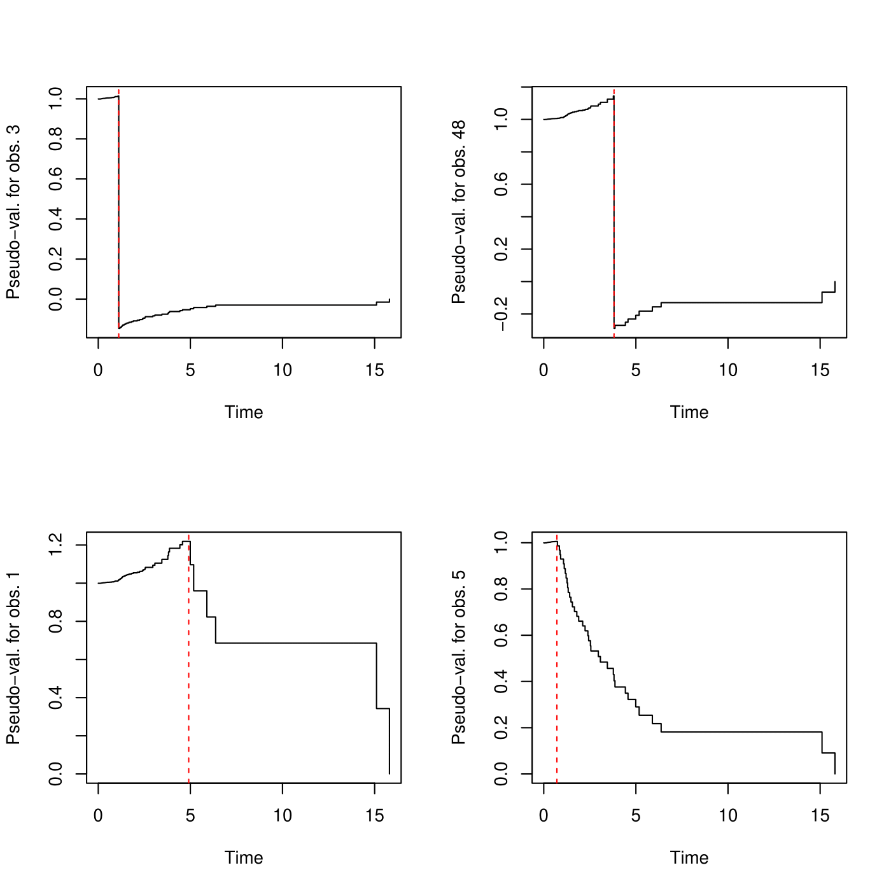

# FastPseudo

<!-- badges: start -->

Implementation of pseudo-values for right-censored or interval-censored data using 
a fast (and very accurate) approximation. Both the pseudo-values for the survival function
and for the Restricted Mean Survival Time (RMST) have been implemented. For right-censored 
observations the algorithms are based on the Kaplan-Meier estimator while for interval-censored 
data they are based on the piecewise constant hazard (PCH) model.

The following functions are for right-censored observations only: 

- `pseudoKM` implements the pseudo-values for the Kaplan-Meier estimator. It can return the pseudo-values for 
the survival function or for the RMST. It takes as input a continuous time variable, its censoring indicator 
and a value of the endpoint if the RMST should be computed.
- `Rmst` computes the RMST for the Kaplan-Meier estimator. It takes as input a continuous time variable, its censoring indicator
and a value of the endpoint for the RMST. 

The following functions are for interval-censored observations (which can contain right-censored data):
- `rsurv` simulates data following a pch model. Only the cuts and values of the hazard between two cuts must be specified.
- `RmstIC` computes the RMST based on the pch model. Only the cuts, values of the hazard between two cuts and 
a value of the endpoint for the RMST must be specified.
- `mleIC` computes the maximum likelihood estimator from a pch model. It takes as input interval-censored data and a sequence 
of cut values. It can also include exact observations. The estimation method is based on the EM algorithm by considering the true 
times as unobserved variables.
- `pchcumhaz` computes the cumulative hazard function of a pch model. It takes as input a sequence of times at which the 
cumulative hazard needs to be computed, the cuts and the values of the hazard between two cuts.
- `pseudoIC` implements the pseudo-values for the survival function or the RMST. The fast approximation is based on the pch model. It takes as input interval-censored data and a value of the endpoint if the RMST should be computed.
Of note, this function cannot currently take into account exact observations but this will be fixed 
soon (hopefully)!

## Installation

You can install the released version of FastPseudo, from the `devtools` package with:

``` r
install_github("obouaziz/FastPseudo")
library(FastPseudo)
```

## Statistical Methodology

The programs are based on the following paper: [CRAN](https://CRAN.R-project.org). 
While the paper mentions that the pseudo-values are approximations of the standard 
jackknife method, it is important to stress that the approximation is extremely 
accurate even for small sample sizes.

## Examples for right-censored data

We start with a very simple example. We first simulate true survival times following the Weibull 
distribution and a censoring variable giving approximately 21% of censoring. We 
then use the function `pseudoKM` to compute pseudo values for the survival function. Pseudo-value plots for 
two non-censored observations and two censored observations are displayed.

``` r
require(devtools)
install_github("obouaziz/FastPseudo")
library(FastPseudo)
require(survival)
n=100
cpar=0.1
set.seed(28)
TrueTime=rweibull(n,shape=0.5,scale=2)
Cens=rexp(n,cpar)
Tobs=pmin(TrueTime,Cens) #observed times
status=TrueTime<=Cens #mean(status) #21% of censoring on average

#use tau=NULL to specify that the pseudo-values are for the survival
#function and not for the RMST.
pseudo_val=pseudoKM(Tobs,status,tau=NULL)
pseudoval=pseudo_val$pseudoval
tseq=pseudo_val$tseq

par(mfrow=c(2,2))
plot(tseq,pseudoval[,3],type="s",xlab="Time",ylab="Pseudo-val. for obs. 3")
abline(v=Tobs[3],lty=2,col="red")
plot(tseq,pseudoval[,48],type="s",xlab="Time",ylab="Pseudo-val. for obs. 48")
abline(v=Tobs[48],lty=2,col="red")
plot(tseq,pseudoval[,1],type="s",xlab="Time",ylab="Pseudo-val. for obs. 1")
abline(v=Tobs[1],lty=2,col="red")
plot(tseq,pseudoval[,5],type="s",xlab="Time",ylab="Pseudo-val. for obs. 5")
abline(v=Tobs[5],lty=2,col="red")
par(mfrow=c(1,1))
```



The two above plots correspond to non-censored observations while the two below plots 
correspond to censored observations. The red dotted lines indicate when the observations 
occurred. 
We now simulate right-censored data from a Cox model with Weibull baseline. There 
is only one covariate whose effect is equal to -0.69315. We compute the pseudo-values 
at 10 different time points and we implement generalised estimating equations using the 
`geepack`package with link function equal to log(-log(.)). We should retrieve the 
value of the parameter.
``` r
set.seed(28)
require(geepack)
require(survival)
n=4000
shape=3;scale=30;cpar=0.01
#Simulate covariates
X=runif(n,0,1)
#simulate Cox model with Weibull baseline distribution
TrueTime=scale*(rexp(n,1)/exp(log(0.5)*X))^(1/shape)
#True regression parameter is log(0.5)=-0.6931472
Cens=rexp(n,cpar)
Tobs=pmin(TrueTime,Cens) #observed times
Tsort<-sort(Tobs,index.return=TRUE)
Tobs_ord<-Tsort$x
status=TrueTime<=Cens #mean(status) #25% of censoring on average
status_ord<-status[Tsort$ix]
X_ord=X[Tsort$ix]
SurvEst<-matrix(NA,n,n)

#Compute pseudo-values using pseudoKM
pseudo=pseudoKM(Tobs,status,tau=NULL)
#the pseudo values. Individuals are on the columns, while the time is on the rows.
pseudo_val=pseudo$pseudoval 
pseudo_val=pseudo_val[n*seq(5,95,by=10)/100,] #we compute the pseudo-values for 10 times
tseq=pseudo$tseq[n*seq(5,95,by=10)/100]
M=10
data_pseudo1<-data.frame(Y=1-c(pseudo_val),X=rep(X,each=M),Time=rep(tseq,n),id=rep(1:n,each=M))
#data_pseudo1<-data.frame(Y=1-c(pseudo_val),X=rep(X_ord,each=M),Time=rep(tseq,n),id=rep(1:n,each=M))
result<-geese(Y~X+as.factor(Time)-1,id=id,jack=TRUE,family="gaussian",
mean.link="cloglog", corstr="independence",scale.fix=TRUE,data=data_pseudo1)
summary(result)
```

Here is the output (we only display the effect of X). We obtain an effect very 
close to the true value.

Call:
geese(formula = Y ~ X + as.factor(Time) - 1, id = id, data = data_pseudo1, 
    family = "gaussian", mean.link = "cloglog", scale.fix = TRUE, 
    corstr = "independence", jack = TRUE)

Mean Model:
 Mean Link:                 cloglog 
 Variance to Mean Relation: gaussian 

 Coefficients:

|               | estimate    |     san.se |     ajs.se  |   wald   |        p
| ------------- |:----:|:----:|:----:|:----:|:----:| 
X               | -0.70061472 | 0.07440208 | 0.07434210  | 88.672378| 0.000000e+00 


Scale is fixed.

Correlation Model:
 Correlation Structure:     independence 

Returned Error Value:    0 
Number of clusters:   4000   Maximum cluster size: 10 

We now illustrate the pseudo-values for the RMST. We first simulate data according to 
a linear model with two covariates. It can be shown that the corresponding RMST will 
then follow a linear relationship with respect to the four covariates constructed from all 
possible interactions. The true effects were empirically estimated (using the true times) 
on a sample of size 1e7 and were found to be equal to 3.812552, 0.05705492, 0.05730445, 0.1044318.

``` r
#Simulation in a linear model
set.seed(28)
n<-10000
sigma=3
cpar=0.07
tau=4
alpha=c(5.5,0.25,0.25)
X1=rbinom(n,1,0.5)
X2=rbinom(n,1,0.5)
epsi=runif(n,-sigma,sigma)
TrueTime=alpha[1]+alpha[2]*X1+alpha[3]*X2+epsi
Cens=rexp(n,cpar)
Tobs=pmin(TrueTime,Cens)
Tsort<-sort(Tobs,index.return=TRUE)
Tobs_ord<-Tsort$x
status=TrueTime<=Cens #approximately 35% of censoring
status_ord<-status[Tsort$ix]
X_ord1=X1[Tsort$ix];X_ord2=X2[Tsort$ix]
X00=(X1==0 & X2==0)
X01=(X1==0 & X2==1)
X10=(X1==1 & X2==0)
X11=(X1==1 & X2==1)
X_ord00=X00[Tsort$ix];X_ord01=X01[Tsort$ix];X_ord10=X10[Tsort$ix];X_ord11=X11[Tsort$ix]
#The true value of the parameters are c(3.812552,0.05705492,0.05730445,0.1044318)

pseudo_val=pseudoKM(Tobs,status,tau)$pseudoval
data_pseudo<-data.frame(Y=c(pseudo_val),X2=X01,X3=X10,X4=X11,id=rep(1:n))
result=geese(Y~X2+X3+X4,id=id,jack=TRUE,family="gaussian",
mean.link="identity", corstr="independence",scale.fix=TRUE,data=data_pseudo)
summary(result)
```

Call:
geese(formula = Y ~ X2 + X3 + X4, id = id, data = data_pseudo, 
    family = "gaussian", mean.link = "identity", scale.fix = TRUE, 
    corstr = "independence", jack = TRUE)

Mean Model:
 Mean Link:                 identity 
 Variance to Mean Relation: gaussian 

 Coefficients:
 
 |               | estimate    |     san.se |     ajs.se  |   wald   |        p
| ------------- |:----:|:----:|:----:|:----:|:----:| 
(Intercept) | 3.82269101 | 0.008294085 | 0.008295309 | 212422.96376 | 0.0000000000
X2TRUE      | 0.04045047 | 0.010693009 | 0.010694562     | 14.31025 | 0.0001550181
X3TRUE      | 0.04017529 | 0.010816528 | 0.010818171     | 13.79565 | 0.0002038073
X4TRUE      | 0.09621505 | 0.009633681 | 0.009635118     | 99.74738 | 0.0000000000

Scale is fixed.

Correlation Model:
 Correlation Structure:     independence 

Returned Error Value:    0 
Number of clusters:   10000   Maximum cluster size: 1 

## Examples for interval-censored data

We start by simulating true time events from the piecewise constant hazard model using the 
`rsurv`function. We use three cut points and specify hazard values for the four segments 
of cuts. We then generate interval-censored data through a visit process. Our simulation 
setting leads to 21% of right-censored data. There are 34% of left intervals (whose right 
interval is finite) that fall into the first cut segment. There are 11.5% of left intervals that 
fall after the last cut.

```r
set.seed(28)
n=4000
cuts=c(20,40,50)
alpha=c(0.01,0.025,0.05,0.1)
TrueTime=rsurv(n,cuts,alpha) #generate true data from the pch model
#Simulation of interval-censored data
Right<-rep(Inf,n)
nb.visit=5
visTime=0;visit=matrix(0,n,nb.visit+1)
visit=cbind(visit,rep(Inf,n))
visit[,2]=visit[,1]+stats::runif(n,0,20)#runif(n,0,5)
schedule=12
for (i in 3:(nb.visit+1))
{
  visit[,i]=visit[,i-1]+stats::runif(n,0,schedule*2)
}
Left<-visit[,(nb.visit+1)]
J=sapply(1:(n),function(i)cut(TrueTime[i],breaks=c(visit[1:(n),][i,]),
                              labels=1:(nb.visit+1),right=FALSE)) #sum(is.na(J)) check!
Left[1:(n)]=sapply(1:(n),function(i)visit[1:(n),][i,J[i]])
Right[1:(n)]=sapply(1:(n),function(i)visit[1:(n),][i,as.numeric(J[i])+1])
#View(data.frame(Left,Right,TrueTime)) #To see the generated data
#mean(Right==Inf) #21% percentage of right-censored data
#mean(Left<20 & Right!=Inf) #34% of observations
#mean(Left>50) #11.5% of observations
result=mleIC(Left,Right,cuts=cuts,a=rep(log(0.5),length(cuts)+1),
             maxiter=1000,tol=1e-12,verbose=FALSE)
#use verbose=TRUE to display all steps of the EM algorithm.
#note that mleIC can also deal with exact observations. They can be specified by simply 
#setting the same value for the Left and Right components corresponding to those 
#exact values.
result$lambda
```

[1] 0.01016437 0.02550410 0.04860803 0.09904368

We now illustrate that the `plot`function can be used, either to plot the survival 
function or the hazard function. The pseudo-values of the survival function evaluated 
at 10 different time points are computed using the `pseudoIC` function. We show that averaging 
the pseudo-values over all individuals for each time point gives back the initial survival 
estimator. This is a well known property of pseudo values.

```r
plot(result,surv=TRUE)
tseq=seq(30,90,length.out=10)
pseudo_val=pseudoIC(result,Left,Right,tseq=tseq,tau=NULL)
lines(tseq,apply(pseudo_val,2,mean),type="p",col="red")
```


We now show that in order to obtain pseudo values for the RMST, we just need to 
specify a value for `tau` in the `pseudoIC` function. We look at the values 
tau=30, 45, 50. We also show how to use the 
`RmstIC` function that computes the RMST for a given value of tau. By averaging the pseudo 
values as before, we see that we obtain again the value of the initial RMST estimator.

```r
#Estimated value of RMST for tau=30
RmstIC(cuts,result$lambda,tau=30)
```
restricted mean with upper limit = 30

[1] 25.3011

```r
pseudoval=pseudoIC(result,Left,Right,tau=30) #pseudo-values
mean(pseudoval)
```

[1] 25.30107

```r
#Estimated value of RMST for tau=45
RmstIC(cuts,result$lambda,tau=45)
```
restricted mean with upper limit = 45

[1] 33.0575

```r
pseudoval=pseudoIC(result,Left,Right,tau=45) #pseudo-values
mean(pseudoval) #is close to the estimated RMST
```

[1] 33.05745

```r
#Estimated value of RMST for tau=50
RmstIC(cuts,result$lambda,tau=50)
```
restricted mean with upper limit = 50

[1] 34.7631

```r
pseudoval=pseudoIC(result,Left,Right,tau=50) #pseudo-values
mean(pseudoval) #is close to the estimated RMST
```

[1] 34.76314

Finally we illustrate how the pseudo values for the RMST can be used with generalised 
estimating equations. We first simulate data according to a linear model with one 
covariate and we set tau to infinity (in practice a large value is taken for tau). We then generate 
interval-censored data through a visit process as previously and we use the `geepack` 
package to implement the generalised estimating equations. We hope to retrieve the 
true effect of the covariate and the intercept which are equal to 4 and 6, respectively.

```r
set.sedd(28)
n=1000
tau=3000 #tau is chosen large
X=runif(n,0,2)
epsi=rnorm(n,0,1)
theta0=6;theta1=4
TrueTime=theta0+theta1*X+epsi #we can check that min(TrueTime) is positive!
##Simulation of interval-censored data
Right<-rep(Inf,n)
nb.visit=5#nb.visit=10
visTime=0;visit=matrix(0,n,nb.visit+1)
visit=cbind(visit,rep(Inf,n))
visit[,2]=visit[,1]+runif(n,0,10)#runif(n,0,5)
schedule=2
for (i in 3:(nb.visit+1))
{
  visit[,i]=visit[,i-1]+runif(n,0,schedule*2)
}
Left<-visit[,(nb.visit+1)]
J=sapply(1:(n),function(i)cut(TrueTime[i],breaks=c(visit[1:(n),][i,]),
labels=1:(nb.visit+1),right=FALSE)) #sum(is.na(J)) check!
Left[1:(n)]=sapply(1:(n),function(i)visit[1:(n),][i,J[i]])
Right[1:(n)]=sapply(1:(n),function(i)visit[1:(n),][i,as.numeric(J[i])+1])
cuts=c(6,8,10,12,14)
result=mleIC(Left,Right,cuts=cuts,a=rep(log(0.5),length(cuts)+1),
maxiter=1000,tol=1e-12,verbose=FALSE)
pseudoval=pseudoIC(result,Left,Right,tau=tau)
require(geepack)
data_pseudo<-data.frame(Y=c(pseudoval),X=X,id=rep(1:n))
resultEst=geese(Y~X,id=id,jack=TRUE,family="gaussian", mean.link="identity",
corstr="independence",scale.fix=TRUE,data=data_pseudo)
summary(resultEst)
```

Call:
geese(formula = Y ~ X, id = id, data = data_pseudo, family = "gaussian", 
    mean.link = "identity", scale.fix = TRUE, corstr = "independence", 
    jack = TRUE)

Mean Model:
 Mean Link:                 identity 
 Variance to Mean Relation: gaussian 

 Coefficients:

 |               | estimate    |     san.se |     ajs.se  |   wald   |        p
| ------------- |:----:|:----:|:----:|:----:|:----:| 
(Intercept) | 5.953273 | 0.1161216 | 0.1162682 | 2628.366 0
X     | 3.978100 | 0.1028926 | 0.1030417 | 1494.802 0

Scale is fixed.

Correlation Model:
 Correlation Structure:     independence 

Returned Error Value:    0 
Number of clusters:   1000   Maximum cluster size: 1 

<!-- badges: end -->
